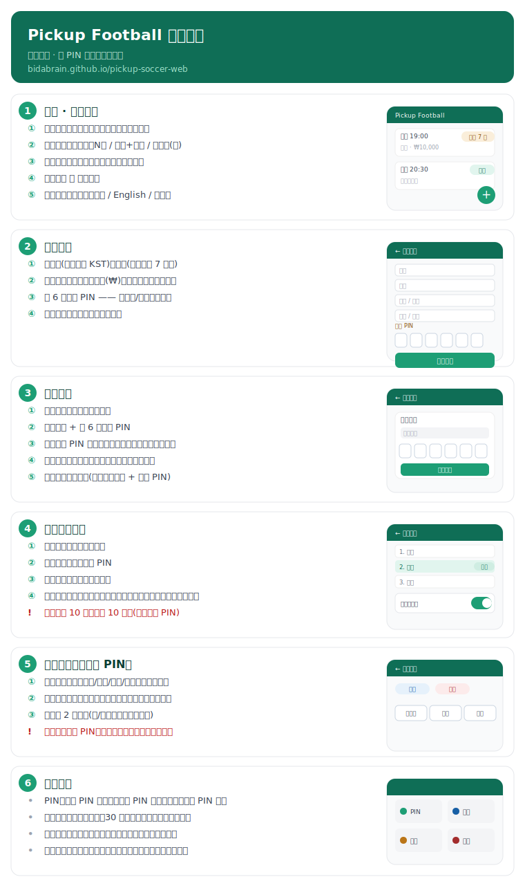

# Pickup Football ⚽

无需注册、凭 PIN 管理预约与报名的业余约球平台。

**线上访问**：https://bidabrain.github.io/pickup-soccer-web/

## 使用说明



> 网站内「使用说明」按钮会按界面语言显示对应版本（[English](web/public/usage-guide-en.svg) · [한국어](web/public/usage-guide-ko.svg)）。

## 技术栈

- **前端**：React + Vite + TypeScript + TailwindCSS → GitHub Pages
- **后端**：Cloudflare Workers + D1 (SQLite)
- **部署**：GitHub Actions 自动部署（push 到 `main` 即上线）

## 目录结构

```
web/      前端（Vite + React）
worker/   后端（Cloudflare Worker + D1）
docs/     使用说明等文档资源
PickupFootball_技术方案_v2.md   完整技术方案
```

## 本地开发

```bash
# 前端
cd web && npm install && npm run dev

# 后端
cd worker && npm install && npm run dev
```

更多设计与接口细节见 [PickupFootball_技术方案_v2.md](PickupFootball_技术方案_v2.md)。
